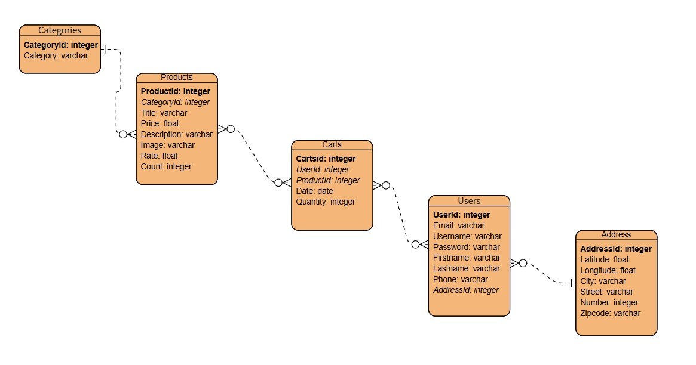

# **Data Warehouse for E-Commerce Analytics**

## **1. Project Overview**
This project demonstrates the development of a complete data engineering workflow to analyze e-commerce sales data. It encompasses the entire ETL (Extract, Transform, Load) pipeline—from extracting data to loading it into a PostgreSQL data warehouse—and generating actionable insights. The project aims to simulate real-world scenarios where structured, actionable data is necessary for decision-making.

### **Project Goals**
- Extract and process data from a public API.
- Design and implement a relational star schema in PostgreSQL.
- Generate meaningful statistics and insights from the data warehouse.
- Document findings and ensure code reproducibility.

---

## **2. Data Workflow**

### **2.1 Data Ingestion**
- **Source**: The [Fake Store API](https://fakestoreapi.com/) provided raw data about products, categories, users, and carts.
- **Process**: Data was fetched using Python (see `scripts/ingestion.py`) and stored as JSON and CSV files in the `data/raw/` directory.

### **2.2 Data Transformation**
- **Cleaning**:
  - Split `rating` into `rate` and `count` in the products data.
  - Flattened the `address` field in user data into individual columns (e.g., `city`, `street`, etc.).
- **Validation**:
  - Checked for missing and duplicate values.
  - Ensured data consistency (e.g., valid references between products and categories).
- **Processed Output**: Cleaned data was saved in `data/processed/` (e.g., `dimension_products.csv`, `fact_carts.csv`).
- Python scripts for this process are in `scripts/transformation.py`.

### **2.3 Data Warehouse Schema**
- **Design**: A star schema was chosen for efficient querying. The final schema includes:
  - **Fact Table**: Carts.
  - **Dimension Tables**: Products, Categories, Users, and Address.
- **Implementation**: The schema was defined in `sql/dw_schema.sql` and created in PostgreSQL using `scripts/modeling.py`.
- **ERD**:
  

---

## **3. Insights and Statistics**

### **Key Insights Generated**
- **Total Revenue per Category**:
  - Identified the revenue generated from each product category.
- **Top 5 Selling Products**:
  - Determined the best-performing products based on sales volume.
- **Sales Trends Over Time**:
  - Analyzed monthly sales revenue trends.

### **Results**
The insights were generated programmatically using `scripts/stats.py`, and results were saved in `data/insights/` as CSV files:
- `total_revenue_per_category.csv`
- `top_5_selling_products.csv`
- `sales_trends_over_time.csv`

---

## **4. Challenges and Solutions**

### **Challenges**
- **Schema Mismatch**: The raw data structure didn't align with the star schema requirements.
  - **Solution**: Used a staging schema to temporarily store raw data before transformation.
- **Data Cleaning**: Address and rating fields required complex transformations.
  - **Solution**: Applied Python scripts to clean and normalize the data.
- **Data Validation**: Ensured all foreign key relationships were valid.

---

## **5. Conclusion**

### **Project Outcomes**
- Successfully implemented a robust ETL pipeline.
- Designed an efficient star schema for analytical queries.
- Generated actionable insights for e-commerce analytics.

### **Future Work**
- Integrate additional APIs for more diverse data.
- Create dashboards using tools like Tableau or Power BI for visualization.
- Implement incremental data loading for scalability.

---

### **Repository Structure**
```
data-warehousing-project/
├── README.md              # Project overview and setup instructions
├── .gitignore             # Ignored files and directories
├── requirements.txt       # Python dependencies for the project
├── data/                  # Data files
│   ├── raw/               # Raw data files
│   ├── processed/         # Cleaned and transformed data files
│   └── insights/          # Insights and statistics (results)
├── scripts/               # Python scripts for ETL and modeling
│   ├── ingestion.py       # Data ingestion
│   ├── transformation.py  # Data transformation
│   ├── modeling.py        # DW schema creation and data loading
│   └── stats.py           # Generate insights and statistics
├── sql/                   # SQL scripts
│   ├── staging_schema.sql # Staging schema
│   ├── dw_schema.sql      # Data warehouse schema
│   └── queries.sql        # Example queries
├── notebooks/             # Jupyter notebooks for exploration
│   └── exploration.ipynb  # Data exploration
├── config/                # Configuration files
│   ├── db_config.json     # Database connection details
│   └── api_config.json    # API configuration
└── reports/               # Reports and documentation
    └── stats_report.md    # Summary of findings and insights
```